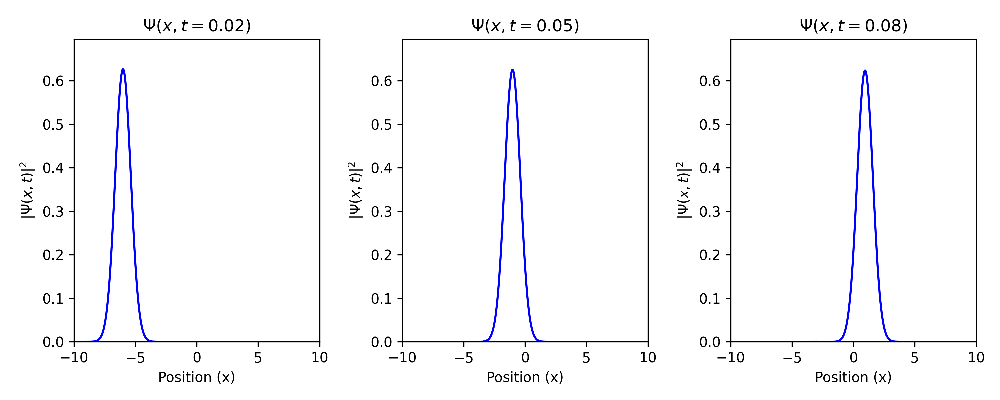
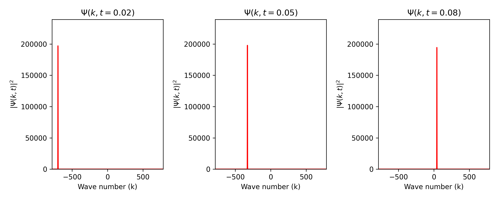
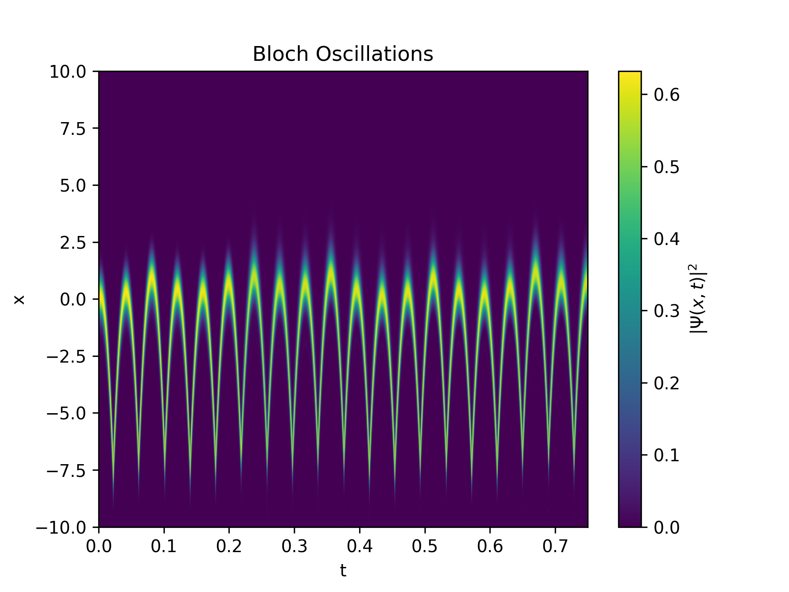

# Bloch Oscillations

This project numerically simulates Bloch oscillations of a particle in a periodic potential subjected to a constant external force (like an electron in a crystal subject to an electrostatic field), using a simple implementation of split-step Fourier methods.

For the general one-dimensional case, the effective Hamiltonian is

$$
\hat{H}(x) = -\frac{\hbar^2}{2m}\frac{d^2}{dx^2}+V_0 \cos(2\pi x / d)+Fx
$$

To study the dynamics of the system, it is necessary to solve the time-dependent Schrodinger equation

$$
i\hbar\frac{d}{dt}\ket{\Psi(t)}=\hat{H}\ket{\Psi(t)}
$$

The main idea of the **split-step Fourier** method is to divide the time evolution into steps

$$
\psi(x, t+\Delta t) = e^{-i\Delta t \hat{H} / \hbar} \psi(x,t)
$$

Since the kinetic part of the Hamiltonian is not diagonal in position space, it is convenient to perform a Fourier transform to perform the calculations in reciprocal space, such that the approximation for each time step is given by

$$
\psi(x, t+\Delta t) \approx \\ e^{-\frac{i}{2\hbar} V(x)\Delta t} \mathcal{F}^{-1} \left[e^{-\frac{i\hbar k^2}{2m}} \mathcal{F}\left[e^{-\frac{i}{2\hbar} V(x)\Delta t} \psi(x, t) \right] \right]
$$

*To represent the particle, an initial Gaussian wave packet was used.*

## Features

- Numerical solution of the Schrödinger equation in a periodic potential.
- Visualization of the wave function evolution in real and reciprocal spaces.
- Heat map representations of probability densities.

---

## Project Structure

- `bloch_osc.py`: Contains the main script for simulating and visualizing Bloch oscillations.
- `ssf_fourier.py`: Provides the split-step Fourier method implementation for solving the Schrödinger equation.
- `images/`: Folder for saving generated plots and visualizations.

---

## Prerequisites

Ensure you have Python 3 and the following dependencies:

```bash
numpy
matplotlib
```

---

## Installation

1. Clone this repository:

   ```bash
   git clone https://github.com/yourusername/Bloch_Osc.git
   cd Bloch_Osc
   ```

2. Create a virtual environment and activate it:

   ```bash
   python3 -m venv .venv
   source .venv/bin/activate  # Linux/MacOS
   ```

3. Install dependencies:

   ```bash
   pip install -r requirements.txt
   ```

---

## Usage

Run the simulation with:

```bash
python bloch_osc.py
```

---

## Examples of Visualizations

Below are examples of the generated visualizations:

### Wave functions at different times in both real and reciprocal space




### Density probability in function of time

#### With an external force $F>>V_0$


#### With an external force $F \approx V_0$



---

## License

This project is licensed under the MIT License - see the [LICENSE](LICENSE) file for details.

---

## Author

**Aaron Trinidad**
Physicist and programmer exploring numerical simulations.

Feel free to reach out or contribute.
